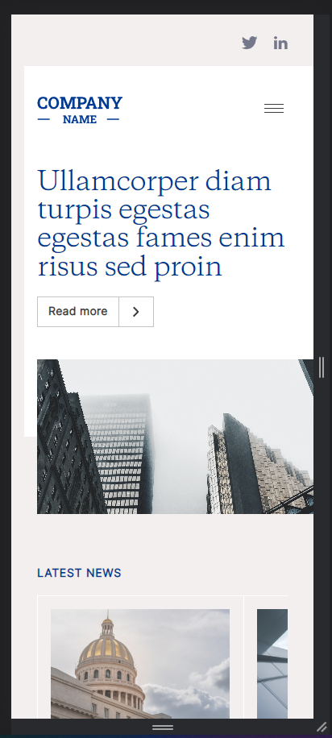
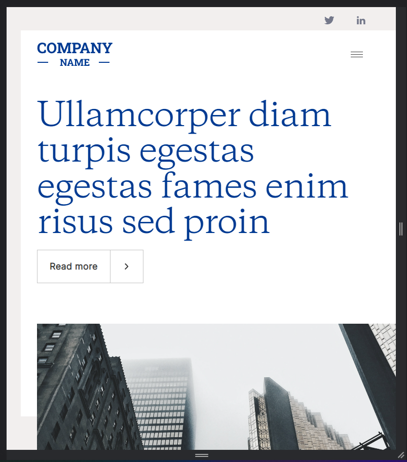
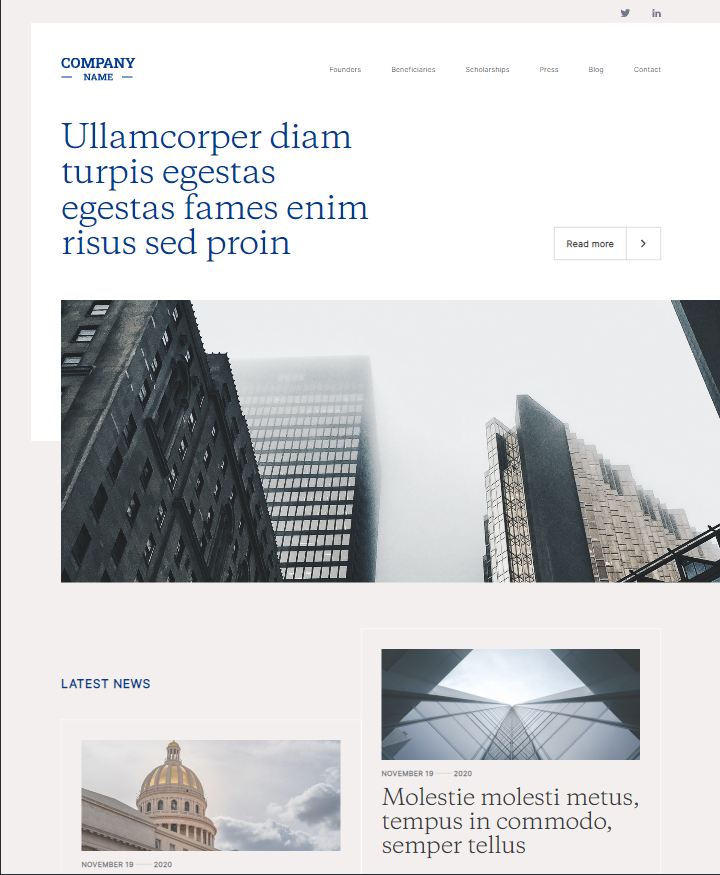

# fea

A quick frontend UI demontration using html5/css3/javascript using gulp bundler.
List of library used on the project.
* fancybox
* splidejs
* aos
* bootstrap 5
* browser sync
* gulp-sass/sass ( preprocessor)
* slick carousel

## screenshot

mobile

tablet

large

## Prerequisite

* check node version `node -v`
* if node version >= 16, you are are good to go
** else install or update your node version to > 16 ( recommended using nvm to update or downgrade node )
* check npm version `npm -v`
** npm version >= ^7
* install gulp `npm install --global gulp-cli`
** version >= (CLI version: 2.3.0 and Local version: 4.0.2)

## How to start

* First clone the repo
* Then install required dependecies `npm install`
* now check if there is any errors => if error follow the prerequisite
* if everything is ok, You can start project by `gulp` on cmd which will start on the brower by browsersync
